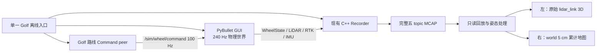

# MID-360 Golf 高保真采集与三维回放设计

> 日期：2026-08-16
>
> 状态：设计已由用户逐段确认，可作为后续实施会话的唯一需求基线
>
> 实施边界：本文是设计规格，不包含代码提交或实施计划

## 1. 目标

新增一条显式的 Golf 离线高保真采集链。它在真实 PyBullet GUI 中让
`df_mid` 车辆持续自动行驶，扫描完整高尔夫地形、静态障碍物和往返运动
障碍物，并生成可回放的五 topic v2 MCAP。

采集完成后自动打开项目内三维回放窗口：

- 左侧显示当前 100 ms 的 MID-360 原始 `lidar_link` 局部点云，保留运动畸变。
- 右侧显示用 RTK、IMU 和冻结外参逐点去畸变后的 Golf 世界累计地图。
- 两侧使用同一 MCAP 时间轴，同步支持播放、暂停、逐帧、倍率和定位。

本设计解决的核心问题不是简单放大现有圆形预览，而是让用户同时看见：

1. MID-360 非重复扫描纹理随车辆运动产生的原始点云变化。
2. 整片 Golf 地形如何在行驶过程中逐步形成世界地图。
3. 静态障碍物和持续运动障碍物在原始云与累计地图中的不同表现。

## 2. 已确认决策

以下决策已经冻结，实施时不得重新解释为其他方案：

- 主验收入口是项目内同步双三维视图，不是现有二维 Dashboard。
- Livox Viewer 2 只用于检查原始局部坐标 LVX2，不承担世界地图回放。
- 保留现有实时档，新增独立离线高保真档。
- 车辆在真实 PyBullet GUI 中由物理车轮驱动，不伪造轨迹、不瞬移。
- 路线为 Golf 全场往复式扫描路线，掉头连续且自动减速。
- 每个 100 ms 雷达帧跨 24 个 240 Hz 物理状态采集。
- 原始点云保留帧内运动畸变；世界地图用真值姿态逐点去畸变。
- 不加入随机噪声、假点、FAST-LIO 漂移或未经资料支持的多回波。
- 新链必须与现有 v2/Recorder/Export 架构无缝衔接。
- 实施、依赖处理、进程启动、测试和 GUI 验收命令均由 Codex 执行，不把命令行步骤交给用户。

## 3. 现有架构边界

### 3.1 必须保持不变

以下行为和接口属于已交付实时架构，离线功能不得改变其语义：

- `Stage4LidarProfile.realtime()` 仍为每 100 ms 5,760 个 firing slots。
- 实时 LiDAR worker 仍使用双 shard 和 100 ms deadline。
- `proto/slope_sim_interfaces_v2.proto` 的字段号、类型和坐标语义保持不变。
- 五个正式 eCAL topic 保持不变：

| Topic | 频率 | 方向 |
|---|---:|---|
| `/sim/wheel/command` | 100 Hz | Simulator 订阅 |
| `/sim/wheel/state` | 100 Hz | Simulator 发布 |
| `/sim/lidar/points` | 10 Hz | Simulator 发布 |
| `/sim/rtk/state` | 10 Hz | Simulator 发布 |
| `/sim/imu/attitude` | 10 Hz | Simulator 发布 |

- C++ Recorder 仍记录原始 v2 payload，保持队列故障、安全停车和原子 finalize 语义。
- 现有 C++ Replay/Export 的默认行为保持不变。
- PCD、PLY 和 LVX2 继续把 `/sim/lidar/points` 解释为原始 `lidar_link` 局部坐标。
- 世界累计地图是新的只读派生产品，禁止写回原始 topic 或冒充原始 LVX2。

### 3.2 显式新增

新增功能只通过一个清晰的离线 Golf 入口进入：

- 离线 MID-360 firing schedule 和分时扫描执行器。
- 固定 Golf 场景、全场路线及其唯一 WheelCommand producer。
- 自动启动、就绪屏障、安全停车、Recorder finalize 和回放启动编排。
- 严格读取完整 MCAP 的同步回放数据层。
- 原始点云、姿态重建、世界体素累计和双三维视图。

离线 profile 不进入实时 worker，也不通过修改全局 5,760 常量实现。必须使用
独立类型表达 20,000-slot 合同，使实时调用方不可能误选离线档。

## 4. 总体数据流

公开编排入口固定为 `scripts/run_mid360_golf_mapping.py`，它负责完整生命周期，
不要求用户分别启动进程：

1. 校验固定场景、官方 pattern、输出路径和现有构建制品。
2. 启动 Recorder、Simulator 和路线 Command peer，并等待身份与订阅者就绪。
3. 打开 PyBullet GUI，按仿真时间执行固定路线和离线扫描。
4. 正常结束或发生故障时先安全停车。
5. 正常路径追加停车尾段，排空并 finalize Recorder。
6. 只有完整 MCAP 校验成功后才自动打开三维回放窗口。

## 5. MID-360 离线扫描合同

### 5.1 冻结参数

| 参数 | 离线高保真值 |
|---|---:|
| 点频 / firing 频率 | 200,000 / s |
| 帧周期 | 100 ms |
| 每帧 firing slots | 20,000 |
| 相邻 firing 时间 | 5 us / 5,000 ns |
| 官方 pattern 行数 | 800,000，4 s 循环 |
| 水平 FOV | 360 度 |
| pattern 实测垂直范围 | -7.21 至 +52.16 度（显示值四舍五入） |
| 量程 | 0.1 至 40 m |
| 回波 | 单回波语义 |

官方方向资产继续使用：

- `slope_sim/assets/mid360_pattern.bin`
- version：`livox-mid360-800000-v1`
- SHA-256：`4077e0b68a68e40ba8a5da17d4aff5ba86ea4fb557a4f8b594e4de1ebbeb20ca`

pattern 起始 phase 继续复用现有 `pattern version + world_generation` 冻结规则；
离线序列使用 20,000 而不是 5,760 作为跨帧步幅。连续 40 帧恰好遍历
800,000 行，然后循环。不得使用官方 Gazebo 示例中的 24,000 点/帧或
200 m 量程冒充 MID-360 产品参数。

### 5.2 240 Hz 分时采集

100 ms 恰好包含 24 个 240 Hz 物理步。20,000 个 firing 按各自
`offset_time_ns` 落入对应物理步，每步得到 833 或 834 条，24 步总和必须
严格等于 20,000。

每个物理步使用以下顺序：

1. 冻结该步起始时刻的车辆、`lidar_link` 和障碍物状态。
2. 对属于该步时间区间的 firing 做一批 PyBullet raycast。
3. 下发下一步路线命令，调用现有障碍物更新和 Bullet 物理步进。
4. 进入下一物理状态。

单批始终低于 PyBullet 16,383 射线上限。离线执行器不使用实时 worker 的
100 ms 墙钟 deadline；机器生成速度可以慢于真实时间，但仿真时间和点时间
必须严格保持 200k firing/s。

本文中的 `T_world_lidar(t_i)` 指 `t_i` 所属 240 Hz 区间起点冻结的姿态；
同一区间内的 833/834 个 firing 共用该状态，不额外伪造 Bullet 子步。由此产生
的最大 4.167 ms 状态量化是本方案明确接受的仿真保真边界。车辆、运动障碍物
和 raycast 必须使用同一量化时刻，禁止不同对象错用相邻物理状态。

### 5.3 原始点坐标与运动畸变

对 firing 时刻 `t_i`：

1. 用该时刻的 `T_world_lidar(t_i)` 将官方局部方向变换到世界。
2. 在 0.1 至 40 m 范围执行 raycast。
3. 命中点保留为 PyBullet 世界真值 `P_world(t_i)`。
4. 写入 MCAP 前计算
   `p_raw(t_i) = inverse(T_world_lidar(t_i)) * P_world(t_i)`。

同一 100 ms 消息内，各点使用各自 firing 时刻的局部坐标。因此车辆直行、
转弯、上下坡和运动障碍都会自然产生帧内形变，这就是左侧原始云要显示的
运动畸变。不得把所有命中逆变换到单一帧首姿态。

`LidarPointCloud.timebase_ns` 是帧首时间；第 `i` 个 firing 的
`offset_time_ns = i * 5,000`，范围为 0 至 99,995,000 ns。消息只包含真实
命中，未命中的 firing 不生成假点，所以 `point_num` 可以小于 20,000。

### 5.4 点语义

- `tag=1`：地形。
- `tag=2`：静态障碍物。
- `tag=3`：运动障碍物。
- 未知命中不得进入永久世界地图。

reflectivity/tag 保持当前合成分类映射：unknown=`80`、terrain=`100`、
static obstacle=`160`、moving obstacle=`200`。它们只用于分类显示，不能宣称
是真实材质反射率。`line` 继续使用现有稳定编码，不新增未经资料支持的物理
通道含义。

## 6. Golf 场景与自动路线

### 6.1 固定验收场景

默认场景固定为：

- 车型：`df_mid`。
- 地形：`golf_heightfield`。
- 起伏：`medium`。
- Golf seed 固定为 `41`，并在 MCAP 身份中记录。
- canonical 场景固定包含 6 个静态障碍物和 3 个沿直线路径往返的运动障碍物。
- 障碍物至少覆盖 box、cylinder 和 sphere 三种现有形状；固定逻辑 ID、尺寸、
  初始位姿和移动路径直接写入场景文件，不在验收运行时随机生成。

场景规划先生成车辆完整路线扫掠区，再放置障碍物。车辆安全走廊定义为路线
中心线与完整车辆水平 AABB 的 Minkowski 和，再向外扩张 0.5 m。所有静态
障碍物 AABB 和运动障碍物整段扫掠 AABB 都必须避开该走廊，但保持在 MID-360
可见范围。首版不实现通用动态避障；它验证的是持续行驶时对静态/运动目标的
扫描。

### 6.2 全场往复式路线

路线根据 `TerrainBounds` 验证，并对 canonical Golf 固定为以下几何：

- 5 条平行扫描带沿世界 X 方向布置，中心 Y 坐标依次为
  `-5.0/-2.5/0.0/2.5/5.0 m`。
- 每条直线段的 X 端点为地形边界向内 2.75 m；相邻带使用半径 1.25 m 的
  半圆 U 形连接，并必须通过完整车辆 AABB 的边界检查。
- 车辆先驶向第一条带的负 X 端，再沿正 X 行驶；后续扫描带方向逐条交替。
- 掉头时减速但不计划停车。
- 从出生点真实行驶到首个扫描带；采集期间不重置或瞬移车辆。
- 直线目标速度为 0.6 m/s；半圆连接段目标速度为 0.3 m/s。
- 复用现有速度/角速度限幅，避免命令阶跃。

路线是按仿真时间参数化的固定轨迹。启动前即可得到物理步数、五 topic 预期
计数和 Recorder 窗口，因此不需要改变现有 Recorder 的精确计数/finalize
语义。车辆未在预定时间内达到相应路线进度时，整个会话判定失败。

### 6.3 命令衔接

离线路线控制器是该会话唯一 `/sim/wheel/command` producer：

- 使用现有 v2 `WheelCommand`、descriptor、session/generation 和车型数组顺序。
- 以 WheelState 仿真时间驱动 100 Hz 命令节拍，不用墙钟速度推进路线。
- 使用最新同身份 RTK/IMU 位姿计算横向和航向误差。
- 只实现固定路线跟踪和安全停止，不演变成 SLAM 或通用导航栈。
- 不绕过 topic 私下操纵机器人；Recorder 能完整记录实际命令。

## 7. 停车、失败和 Recorder 生命周期

以下任一条件触发故障安全停车：

- 车辆进入 Golf 安全边界之外。
- 与已知静态或运动障碍物 body 发生接触；地形和正常车轮接触不算故障。
- 路线误差超过 0.75 m 并持续 1 s。
- 有效前进命令下实际速度低于 0.05 m/s 并持续 2 s。
- LiDAR、RTK、IMU、命令身份、sequence 或 descriptor 出错。
- Recorder 队列溢出、磁盘写入失败或进入 `SafeStopRequired`。
- 用户关闭 GUI、取消运行或进程异常退出。

安全停车必须持续发布零轮速，直到 base 线速度低于 0.02 m/s 且所有驱动轮
角速度绝对值低于 0.1 rad/s，并连续保持 0.2 s；不得只结束进程而让最后命令
保持有效。

正常完成时平滑减速，并继续录制 0.5 s 零命令尾段。尾段保证最后一个
用于世界地图的 LiDAR frame 后仍有下一组 RTK/IMU 姿态节点。随后 Recorder
排空队列并原子 finalize。

失败会话不自动打开回放，也不能把 `.partial` 或 `clean_shutdown=false` 文件
展示为成功 MCAP。保留小型结构化故障结果供实现会话诊断，不自动重复全场运行。

## 8. 世界姿态重建与累计地图

### 8.1 姿态节点

回放层只消费 MCAP，不访问活跃 PyBullet 世界。每个 10 Hz 姿态节点必须来自
同一 session、world generation 和 timestamp 的 RTK/IMU：

1. RTK CENTER 给出固定安装点的世界位置。
2. 完整 `LEFT - RIGHT` 三维基线约束车体局部 `+Y` 方向。
3. IMU roll/pitch 提供剩余姿态约束。
4. 求得唯一、归一化且与前一节点连续的 base quaternion。
5. 应用冻结的 RTK CENTER 与 `base_link -> lidar_link` 外参得到 lidar pose。

禁止把 `heading_rad` 直接当作 ZYX Euler yaw；倾斜地面上两者并不相等。姿态
恢复必须是一个可单独测试的纯函数，并与 PyBullet 真值姿态核对。

df_mid 外参以 URDF 和传感器定义为唯一来源。实施时冻结具体数值并验证：

- `base_link -> lidar_link` 当前平移为 `(0, 0, 0.105) m`。
- RTK CENTER 当前位于 base 局部 `(0, 0, 0.18) m`。

### 8.2 逐点去畸变

对点时刻 `t_i = timebase_ns + offset_time_ns`：

- 在前后两个 10 Hz 姿态节点间线性插值位置。
- 对姿态做最短弧 quaternion SLERP。
- 计算 `P_map = T_world_lidar(t_i) * p_raw(t_i)`。

回放使用一帧 look-ahead。没有后续姿态节点时不得外推；正常采集尾段应使最后
有效 LiDAR frame 获得包围姿态。若输入 MCAP 本身缺少 look-ahead，最后未包围
帧可以在左侧显示，但不能加入右侧世界地图，并必须提示原因。

### 8.3 累计规则

- `tag=1/2` 进入永久世界地图。
- `tag=3` 只进入 0.3 s 仿真时间 TTL 的运动层，不写入永久地图。
- 未知 tag 不进入永久地图。
- 永久地图使用 5 cm 稀疏体素，同一体素只保留一个代表点。
- 地图限制在固定 Golf 世界 AABB，静态显示点最多 500,000。
- 地图存储去重与 GPU 显示抽样分离；显示抽样不得改变原始 MCAP。
- 重新播放或向后定位必须清空并确定性重建，不能把同一路线重复累计。

右侧视野从第一帧起固定到 Golf 全场边界。随着播放只增加已扫描区域，不允许
相机因点数或包围盒变化持续缩放，导致用户再次只能看到一个小圆圈。

## 9. 三维回放窗口

### 9.1 技术边界

窗口继续使用现有 PySide6，并以 `pyqtgraph.opengl.GLViewWidget` 和
`GLScatterPlotItem` 渲染两个 GPU 点云视图。正式环境和 lock 增加 `pyqtgraph`
与 `PyOpenGL`；它们用于满足 20,000 点当前帧、十万级世界地图和 10 Hz 更新，
不是可选装饰依赖。不得改用 Matplotlib mplot3d、二维预览、Open3D、VTK 或
自写 OpenGL renderer 来绕开本文交互和性能验收。

MCAP 必须由成熟解析器读取，不手写二进制格式。项目现有 C++ Reader 没有
Python 交互接口；为保持回放窗口简单可控，增加官方 Python `mcap` 小型
依赖，并同步正式环境与 lock。`mcap`、`pyqtgraph`、`PyOpenGL` 的安装和锁更新
均由实施 agent 完成，不要求用户运行安装命令。

### 9.2 布局与操作

- 左侧约占 43%，显示当前原始 `lidar_link` 点云，固定 0.1 至 40 m 量程。
- 右侧约占 57%，显示固定 Golf 世界范围和车辆已扫描轨迹。
- 两侧都是可旋转、平移、缩放的真实三维视图。
- 右侧提供俯视/三维透视切换；两侧提供视角复位。
- 点大小提供有界调节，默认值必须在当前屏幕上清晰可见。
- 底部提供回到开头、上一帧、播放/暂停、下一帧、时间轴和
  `0.25x/0.5x/1x/2x/4x` 倍率。
- 逐帧固定前进或后退一个 100 ms LiDAR frame。
- 时间轴定位时暂停播放，在后台从正确状态重建地图，完成后再显示目标帧。

UI 线程只处理输入和渲染。MCAP 解码、姿态插值和体素累计在后台执行，通过
有界队列交付不可变结果。若 1x 渲染短暂跟不上，应暂停时间线等待，不允许丢弃
逻辑帧或让队列无界增长。

### 9.3 输入校验

窗口只打开：

- 完整且 clean shutdown 的 MCAP。
- 五 topic 身份、descriptor 和 world generation 一致的会话。
- LiDAR pattern version/digest 与项目资产一致的会话。
- sequence 连续且时间单调的会话。

错误必须在窗口中明确显示；不得猜测外参、跨 generation 拼接或渲染半个会话。

## 10. 真实性范围

本阶段“接近真实 MID-360”具体指：

- 官方非重复扫描方向顺序。
- 200k firing/s 和逐点 5 us 时间。
- 360 度水平视场、官方 pattern 垂直分布和 0.1 至 40 m 量程。
- PyBullet 表面遮挡、距离和单回波命中。
- 车辆与障碍物在 firing 时刻的真实仿真位姿。
- 原始帧运动畸变与基于真值姿态的世界去畸变。
- Golf 全场、静态障碍物和运动障碍物连续回放。

明确不声称实现：

- 真实材料反射率、入射角强度或自动曝光模型。
- 测距随机噪声、雨雾、尘土、镜面反射或串扰。
- 双回波/多回波。
- FAST-LIO、SLAM 漂移或定位融合误差。
- 设备电气、温漂、网络包抖动或 Livox 固件级数字孪生。

## 11. 最小 TDD 与验证策略

本功能包含重要生产行为、跨进程和新回放合同，不能完全取消 TDD；但必须避免
为私有一行 helper、UI 文案或重复分支制造低价值测试。实施按以下最小行为单元
线性 RED/GREEN，每个单元只写能证明合同的聚焦测试：

1. **离线 schedule**：20,000 slots、5 us、官方 pattern 连续性、24 步
   833/834 分配，同时证明 realtime 仍是 5,760。
2. **运动扫描和去畸变**：已知直线/转弯轨迹下 raw cloud 出现预期畸变，
   SLERP/位置插值后恢复世界命中。
3. **路线与安全停车**：短 DIRECT 场景证明真实车轮跟踪、障碍扫掠区避让、
   越界/碰撞/卡死/Recorder fault 归零。
4. **地图和播放时钟**：tag 1/2 永久、tag 3 TTL、暂停/逐帧/倍率、回退重建和
   500,000 点边界。
5. **一次端到端链路**：真实五 topic 记录、完整 MCAP、自动启动三维回放。

验证分级：

- 每个单元只运行新增聚焦测试和直接受影响回归。
- 不在每个子任务后运行完整 pytest、真实 GUI 或全场采集。
- eCAL/Recorder 改动只运行相关跨进程集成门禁，不机械重复无关 Stage1-3 测试。
- 所有实现合并后只运行一次真实 GUI 全场采集和一次相关最终回归。
- 只有该批功能进入正式阶段验收时，才按 `AGENTS.md` 运行一次默认完整回归和
  一次独立只读六维审查；局部修复只做针对性复验。

不得以“减少测试”为由跳过下面的最终验收指标。

## 12. 最终验收指标

| 维度 | 必须满足 |
|---|---|
| firing 合同 | 每 100 ms 20,000 slots；相邻 5 us；24 步总和准确；pattern 连续 |
| 原始点云 | 每点使用对应物理状态；未命中不造点；运动时可观察到帧内畸变 |
| 全场路线 | 真实车轮跑完路线；无瞬移、障碍碰撞或越界 |
| 跟踪质量 | 路线误差 P95 不超过 0.35 m，任何持续误差不得越过 0.75 m 故障线 |
| 持续运动 | 除启动加速、掉头减速和最终尾段外，至少 95% 活跃采集帧实际速度大于 0.1 m/s |
| 地形覆盖 | 去除 1 m 安全边缘和障碍物占地后，以 0.25 m XY 网格统计，tag 1 覆盖率至少 95% |
| 障碍物 | 所有固定障碍被命中；每个运动障碍在至少 10 帧、两个不同位置被 tag 3 命中 |
| 去畸变 | 与同一个 240 Hz 量化状态的 PyBullet 世界命中相比，世界点误差 P95 不超过 5 cm |
| 回放 | 左右同时间；暂停不前进；逐帧为 100 ms；1x 不丢逻辑帧 |
| 世界地图 | 5 cm 体素；tag 3 不永久累计；重复播放不增长；静态点不超过 500,000 |
| 兼容性 | realtime 5,760、v2 golden、五 topic、Recorder、Replay/Export、LVX2 相关回归通过 |

最终人工观感只需要一次：PyBullet GUI 中车辆和运动障碍持续运动；采集完成后
自动打开三维回放，用户能旋转视角并从右侧看到整片 Golf 地形逐步形成。

## 13. 自动执行与制品约束

后续实施会话必须自行完成：

- 读取本文和当前 dirty worktree，保留所有用户已有改动。
- 创建实施计划、修改代码、更新必要 lock、构建已有 C++ 目标。
- 启动/停止 eCAL、Recorder、PyBullet GUI 和回放窗口。
- 运行 RED/GREEN、相关回归和最终 GUI 验收。
- 诊断失败并在当前会话继续修复，不把命令复制给用户执行。

不得把“请用户另开终端运行命令”“请用户手动启动 Recorder”或“请用户手动
授权常规本地命令”设计为流程步骤。只有平台本身强制的新权限边界或项目
`>5 GiB` 写入门禁才构成外部阻塞；正常实现应选择现有本地权限可完成的路径。

为避免额外授权和 SSD 写放大：

- 路线、减速和 0.5 s 尾段的总仿真时长不得超过 240 s；启动前无法满足则拒绝运行。
- 单次 MCAP、必要日志和一个回放索引的预计总量应控制在 4 GiB 内。
- 默认不批量导出逐帧 PCD/PLY，也不创建重复 MCAP 或时间戳构建树。
- 保留一个可复用构建根；失败中间文件在阶段结束时清理。
- 若实施前估算会超过 5 GiB，先优化编码并移除非必要派生制品；不得缩短已批准
  路线、降低 200k firing/s 或改动最终验收范围来规避门禁。

## 14. 后续会话交接

下一实施会话应按以下顺序继续：

1. 读取 `AGENTS.md`、本文、相关现有测试和当前 worktree 状态。
2. 基于本文写一份紧凑实施计划；不得重新发起产品 brainstorming。
3. 先实现独立离线 schedule 和聚焦 RED/GREEN，保持 realtime 代码路径冻结。
4. 再接入分时 raycast、路线 Command peer、Recorder 编排和安全停车。
5. 最后实现 MCAP 派生地图与 PySide6 双三维回放。
6. 合并后只做一次完整的真实 Golf GUI 采集和回放验收。

除非实际代码暴露出与本文矛盾的硬约束，否则实施 agent 应自行做最小技术判断
并继续执行，不要求用户重复确认已经批准的参数、布局、路线或验收标准。

## 15. 参考依据

- MID-360 产品规格：<https://www.livoxtech.com/mid-360/specs>
- 官方 pattern CSV：
  `references/repos/livox_laser_simulation/scan_mode/mid360.csv`
- 当前实时点云：`slope_sim/lidar_pointcloud.py`
- 当前实时 worker：`slope_sim/lidar_worker.py`
- RTK/IMU 真值：`slope_sim/truth_sensors.py`
- 障碍物更新：`slope_sim/obstacles.py`
- 物理主循环：`slope_sim/simulation.py`
- C++ Recorder：`cpp/client/stage4_recorder.cpp`
- C++ MCAP Reader：`cpp/client/mcap_session_reader.cpp`
- 当前 v2 二维预览：`slope_sim/interfaces/v2/dashboard_adapter.py`
